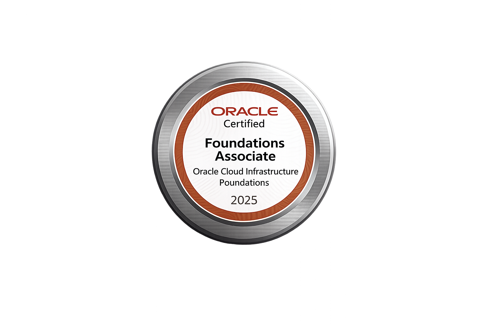

## 📌 About me
Hello, World! I'm Lucas Rossoni Dieder, a Software Engineering focused on back-end development and software architecture.
I develop RESTful APIs and scalable back-end applications using Java, Spring Boot and Python, applying principles such as SOLID, Clean Code and layered architecture. I also work with React and TypeScript for front-end integration and modern web experiences.
Currently interested in distributed systems, cloud computing, DevOps practices and building maintainable, production-ready software through hands-on projects and continuous learning.

> "Begin with what you know. Grow with what you learn."

## 💻 Stacks

## 📫 Contact

