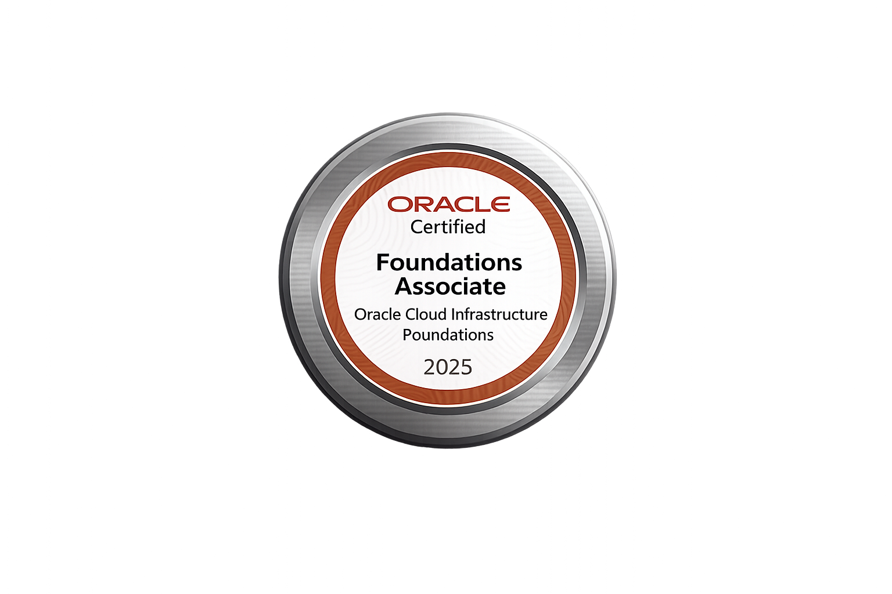

## 📌 About me
Hello, World! I'm Lucas Rossoni Dieder, a Software Engineering focused on back-end development and software architecture.
I develop RESTful APIs and scalable back-end applications using Java, Spring Boot and Python, applying principles such as SOLID, Clean Code and layered architecture. I also work with React and TypeScript for front-end integration and modern web experiences.
Currently interested in distributed systems, cloud computing, DevOps practices and building maintainable, production-ready software through hands-on projects and continuous learning.

> "Begin with what you know. Grow with what you learn."

## 💻 Stacks

## 🚀 Featured Project

### ⚡ EnergiAI — Software Engineer

EnergiAI is an energy-efficiency MVP that transforms electricity-consumption data into energy profile classifications, usage recommendations, and estimated monthly costs.

- Developed and evolved backend services with **Java 21, Spring Boot, Spring Data JPA/Hibernate, Flyway, and Oracle Autonomous Database**.
- Implemented security flows with **Spring Security, JWT, rotating opaque refresh tokens, CSRF protection, and ownership-based authorization**.
- Provisioned cloud infrastructure on **OCI with Terraform**, containerized services with **Docker**, and automated validation and deployment with **GitHub Actions**.
- Integrated the Spring Boot backend with a **FastAPI** Machine Learning service and a resilient local fallback strategy.
- Contributed across **software architecture, API contracts, frontend integration, CI/CD, cloud, testing, and technical documentation**.
- Final backend release validated with **266 passing tests, 0 failures, and 0 errors**.

**Stack:** Java 21 · Spring Boot · React · TypeScript · FastAPI · Oracle Autonomous Database · OCI · Terraform · Docker · GitHub Actions · Playwright

[🔗 Repository](https://github.com/No-Country-simulation/g9-br-team-09) · [🌐 Live Demo](https://energiai.vercel.app)

## 📫 Contact

## 🏆 Certifications

  
